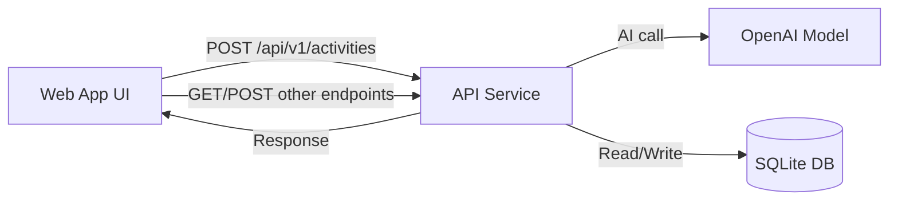
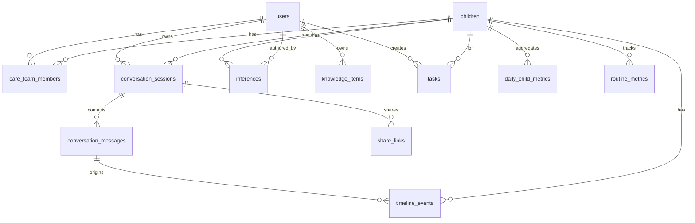

# Havi System Model (Data, Messaging, and Architecture)

This document summarizes the current data model, how messages are composed, and the overall architecture. It is written for non‑technical readers and grounded in the actual code.

## Plain‑English Architecture Overview (High Level)

**Think of Havi as three layers that work together:**

1. **Web App (What you see)** – The browser UI where caregivers type or speak messages, review timelines, tasks, and knowledge items. The web app calls the API to save and fetch data.
2. **API Service (The brain and traffic controller)** – Receives chat messages, routes them to the AI, writes data to the database, and returns a composed reply. This is where the main logic lives.
3. **SQLite Database (The memory)** – Stores users, children, conversations, logs, timeline events, tasks, knowledge, and metrics.

### Architecture Diagram (Plain‑English View)

## Data Model (What gets stored and why)

Below is a simplified summary of the database tables and how they relate. For each item, the goal is to explain **what it is** and **why it matters**.

### Core Profiles

- **`users`** – The caregivers using the system (name, email, relationship).
- **`children`** – The child being tracked (name, birth date, timezone, weights).
- **`care_team_members`** – Links caregivers to children with roles/statuses.

### Conversation & Messaging

- **`conversation_sessions`** – A chat session (title, last message time, catch‑up mode).
- **`conversation_messages`** – Individual messages inside a session (role, content, intent).
- **`share_links`** – Public share tokens for a conversation session.
- **`message_feedback`** – Thumbs up/down + text feedback about a message.

### Logging & Timeline

- **`activity_logs`** – Raw caregiver input + AI‑derived actions (JSON).
- **`timeline_events`** – Canonical events shown on the timeline (sleep, diapers, etc.).

### Knowledge & Inferences

- **`inferences`** – AI‑derived facts or hypotheses (pending/confirmed/rejected).
- **`knowledge_items`** – Stored “memory” items, explicit or inferred.

### Tasks & Metrics

- **`tasks`** – Reminders/To‑dos with status and due date.
- **`daily_child_metrics`** – Daily aggregated metrics per child.
- **`routine_metrics`** – Tracks how often routine prompts are shown/accepted.
- **`loading_metrics`** – Client timing stats for response performance.

### Data Model Diagram (Relationships)

## How Messages Are Composed (Plain English)

When a caregiver sends a message, the system follows a structured pipeline. The goal is **log what happened**, **store it**, and **respond with helpful guidance**.

### Message Composition Pipeline

1. **Receive the message** – The API accepts a `ChatRequest` (message + optional child/timezone/session).
2. **Find or create the conversation** – Messages are stored in `conversation_sessions` and `conversation_messages`.
3. **Build message context** – The system compacts the prior messages into a limited context pack for the AI.
4. **Classify intent** – The router decides whether this is logging, a question, or a task.
5. **Call the AI** – The OpenAI client converts the free‑text message into structured `Action` objects.
6. **Persist logs and timeline events** – Actions are stored and projected into timeline events.
7. **Compose the assistant response** – The reply is built using `build_assistant_message` (logging vs guidance).
8. **Store assistant message** – The composed response is saved in `conversation_messages`.

### What Actually Goes Into the Reply

- **If the message is a straight log**, the assistant keeps it short: “Logged: …” with a single optional follow‑up.
- **If the message needs guidance**, the assistant builds a richer response using stage guidance, knowledge, and prompts.

## Questions to Confirm (Non‑Technical)

These are open questions that affect how the data model should evolve:

1. **Are there multiple caregivers per child in production?** If so, we should confirm whether `users` and `care_team_members` are the intended source of truth and whether the UI supports switching between caregivers.
2. **Is the timeline the canonical history or is the chat log the source of truth?** Today, the timeline events are derived from actions and linked to messages, so we should confirm which record drives analytics and exports.
3. **How long should share links live?** The data model includes `expires_at`, but the behavior is not described in the docs.
4. **What constitutes a “knowledge item” vs. a temporary inference?** This affects privacy and data retention.

## Risks & Concerns (Plain‑English)

1. **Single database file risk** – SQLite is a single file, so if it’s corrupted or grows large, it can become a bottleneck. This matters for scaling and backups.
2. **Knowledge vs. inference drift** – Inferred facts might persist longer than intended unless regularly reviewed or expired.
3. **Timeline accuracy depends on message parsing** – The timeline only knows what the AI can extract from text. If the AI misreads a message, the timeline could be wrong.
4. **Feedback records are not tied to a specific model run** – The schema allows metadata, but nothing guarantees consistent model versioning.

## Recommendations & Trade‑Offs (Plain‑English)

1. **Define the “system of record”** (timeline vs. conversation vs. activity log).  
   - **Benefit:** Clear source for reports and exports.  
   - **Trade‑off:** You may need to backfill or transform data when definitions change.  
   - **Why it matters:** It affects how you set up database integrations downstream.  

2. **Add retention/expiration rules for inferences and share links.**  
   - **Benefit:** Keeps data fresh and reduces privacy risk.  
   - **Trade‑off:** You might lose older context unless explicitly saved as knowledge.  

3. **Create a migration plan if moving off SQLite.**  
   - **Benefit:** Easier scaling, better concurrency, and analytics integration.  
   - **Trade‑off:** Higher operational overhead and a need to design migration scripts.  

4. **Standardize message metadata for analytics.**  
   - **Benefit:** Easier to analyze model quality and caregiver satisfaction.  
   - **Trade‑off:** Requires consistent logging and versioning across the API.  

## Tasks to Address Risks (Plain‑English)

1. **Decide and document the “source of truth” for logs.**  
   - Output: A one‑page policy in docs (e.g., timeline events are canonical).  

2. **Define data retention policies.**  
   - Output: Rules for how long inferences and share links stay active.  

3. **Add scheduled cleanup or archival jobs.**  
   - Output: A background task to expire old share links and stale inferences.  

4. **Design a DB migration plan.**  
   - Output: A lightweight migration checklist for moving from SQLite to a managed DB.

## Files and Code Anchors Referenced

- `apps/api/app/db.py` – database schema definitions and helpers.
- `apps/api/app/schemas.py` – request/response and Action schema.
- `apps/api/app/openai_client.py` – AI system prompt and action JSON schema.
- `apps/api/app/context_pack.py` – context packing logic for message history.
- `apps/api/app/conversations.py` – conversation/session message storage.
- `apps/api/app/main.py` – assistant response composition logic.
- `docs/architecture.md` – existing architecture map.
